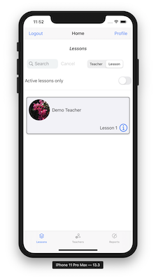
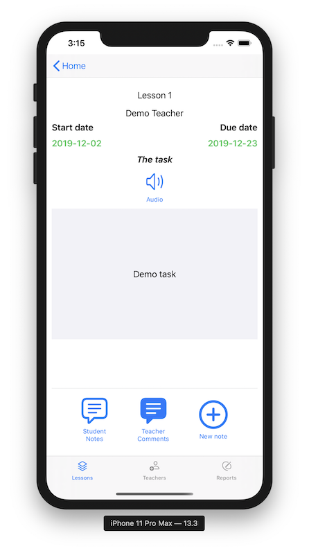

<h2 id="welcome">

 
Welcome to <strong>Sarah Class App</strong> information page

</h2>

**Sarah Class App** is for students wanting to learn English online with a native English teacher.

## Students must first contact the teacher about the lessons.

Once the teacher has been contacted, a student account will be setup and all the details of how to login will be sent to you.

<h2 id="contact">

 
<a href="mailto:ringowathelet@gmail.com?subject=New student"><u>Contact the teacher</u></a>

</h2>

  

**Sarah Class App** for iOS and for Mac are free and are available on the Apple Store.

#### For iPhone and iPad

#### For Mac

# How to use Sarah Class App

The main concepts are **lessons** and **notes**. 

Lessons are initiated by the teacher and received by the student. A lesson consists 
of a task for the student to undertake. Within a lesson the student sends notes to the teacher 
and the teacher reply to the student notes until the lesson is completed. 
A note is a text message but can include a document attachment, a picture and an audio message.

   
        

            
        

        

            
        

        

            
        

        

            
        

# 

# Sarah Class App assist.

Please address all correspondence regarding the **Sarah Class App** to: <SarahClass.assist@gmail.com>

# Privacy Policy
 
The following *Privacy Policy* applies to **Sarah Class** for iOS and macOS (the Apps).
 
##### Information Collection, Use, and Sharing
 
**Sarah Class** Apps do not:
 
 * collect, access or record any personal information,
 * collect, access or record any location information,
 * contain any In-App purchase,
 * display any advertising,
 * ask for credit card number or any payment, it is free, 
 * ask for any personal information,
 * lock you into subscription.
   
 We only have access to information that you voluntarily give us via email 
 or other direct contact from you. We will not sell or rent this information to anyone.
 
 We will use your information to respond to you, regarding the reason you contacted us. 
 We will not share your information with any third party outside of our organization, 
 other than as necessary to fulfill your request.
 
 Unless you ask us not to, we may contact you via email in the future to answer your 
 questions regarding the **Apps** or changes to this privacy policy.
 
#### Your Access to and Control Over Information 
 
You may opt out of any future contacts from us at any time. 
 
If you feel that we are not abiding by this privacy policy, you should contact us 
immediately via email <SarahClass.assist@gmail.com>.
 
